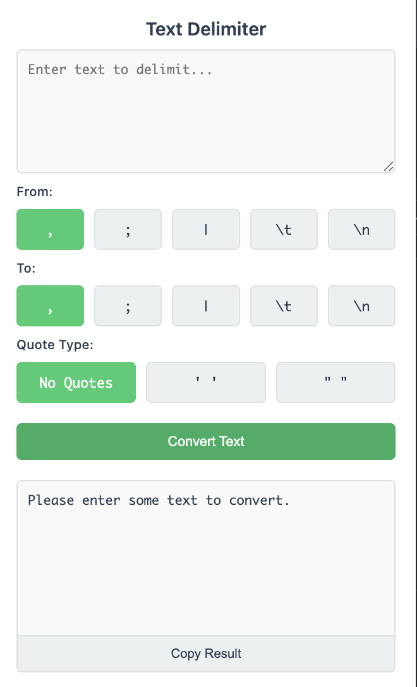

# Delimiter Chrome Extension

A simple Chrome extension for converting text between different delimiters.

## Features

- Convert text between different delimiters (comma, semicolon, pipe, tab, newline)
- Support for custom delimiters
- Option to add quotes (single or double) to delimited items
- Clean and intuitive interface with button-based delimiter selection
- Real-time text conversion
- Easy copy functionality for results

## Installation

1. Clone this repository or download the source code
2. Open Chrome and go to `chrome://extensions/`
3. Enable "Developer mode" in the top right
4. Click "Load unpacked" and select the extension directory

## Usage

1. Click the extension icon in your Chrome toolbar
2. Enter the text you want to convert in the input area
3. Select the "From" delimiter (the current delimiter in your text)
4. Select the "To" delimiter (the desired output delimiter)
5. Choose quote type if needed (No Quotes, Single Quotes, or Double Quotes)
6. Click "Convert Text" to see the result
7. Use the "Copy Result" button to copy the converted text

## Delimiter Options

### From/To Delimiters
- Comma (,)
- Semicolon (;)
- Pipe (|)
- Tab (\t)
- Newline (\n)
- Custom delimiter (enter your own)

### Quote Types
- No Quotes
- Single Quotes (' ')
- Double Quotes (" ")

## Development

The extension consists of:
- `popup.html`: The main interface
- `popup.js`: The JavaScript logic
- `manifest.json`: Extension configuration

## License

MIT License 